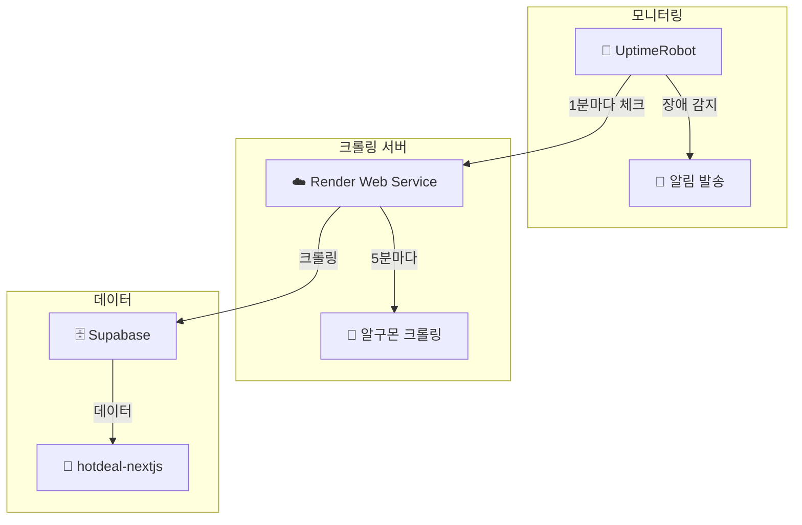

# 🤖 UptimeRobot 모니터링 설정 가이드

**🎯 목표**: Render Web Service + UptimeRobot으로 24/7 안정적인 크롤링 서버 운영

---

## 🚀 1단계: Render.com 배포

### **Web Service 배포**
1. [Render.com](https://render.com) 로그인
2. **"New +"** → **"Web Service"** 선택
3. GitHub 저장소: `hwangjun/algumon-crawler` 연결

### **배포 설정**
```bash
Service Name: algumon-crawler
Environment: Node
Region: Oregon (US West) - 빠른 응답
Branch: main
Build Command: npm install
Start Command: npm start
Instance Type: Free
```

### **환경변수 설정**
```bash
SUPABASE_URL=https://lywpfaklcxbtjixmnjfg.supabase.co
SUPABASE_ANON_KEY=eyJ...
NODE_ENV=production
PORT=3000  # 자동 설정됨
```

### **배포 확인**
- 배포 완료 후 Service URL 확인: `https://algumon-crawler-xxx.onrender.com`
- Health Check: `https://algumon-crawler-xxx.onrender.com/health`

---

## 🤖 2단계: UptimeRobot 설정

### **계정 생성**
1. [UptimeRobot.com](https://uptimerobot.com) 가입
2. 무료 플랜 (50개 모니터까지 무료)
3. 대시보드 접근

### **모니터 설정**

#### **🔍 Monitor #1: Health Check**
```bash
Monitor Type: HTTP(s)
Friendly Name: 알구몬 크롤러 - Health Check
URL: https://algumon-crawler-xxx.onrender.com/health
Monitoring Interval: 1 minute (무료)
Monitor Timeout: 30 seconds
HTTP Method: GET (default)
```

**Advanced Settings:**
```bash
Keyword Monitoring: Yes
Keyword Type: Exists  
Keyword: "healthy"
```

#### **🔍 Monitor #2: Main Service**  
```bash
Monitor Type: HTTP(s)
Friendly Name: 알구몬 크롤러 - 메인 서비스
URL: https://algumon-crawler-xxx.onrender.com/
Monitoring Interval: 5 minutes
Monitor Timeout: 30 seconds
HTTP Method: GET
```

**Advanced Settings:**
```bash
Keyword Monitoring: Yes
Keyword Type: Exists
Keyword: "알구몬 크롤링 서버"
```

#### **🔍 Monitor #3: Stats API**
```bash
Monitor Type: HTTP(s)
Friendly Name: 알구몬 크롤러 - 통계 API
URL: https://algumon-crawler-xxx.onrender.com/status
Monitoring Interval: 10 minutes
Monitor Timeout: 30 seconds
HTTP Method: GET
```

**Advanced Settings:**
```bash
Keyword Monitoring: Yes
Keyword Type: Exists
Keyword: "success"
```

---

## 🚨 3단계: 알림 설정

### **Alert Contacts 추가**
1. **My Settings** → **Alert Contacts** 클릭
2. **Add Alert Contact**

#### **이메일 알림**
```bash
Alert Contact Type: E-mail
Friendly Name: 관리자 이메일
E-mail: your-email@example.com
```

#### **Webhook 알림** (선택사항)
```bash
Alert Contact Type: Webhook
Friendly Name: 슬랙/디스코드 웹훅
Webhook URL: https://hooks.slack.com/...
POST Value: Custom JSON
```

**Custom JSON:**
```json
{
  "text": "🚨 *monitorFriendlyName* is *alertTypeFriendlyName*!\n📊 Status: *alertDetails*\n🔗 URL: *monitorURL*",
  "username": "UptimeRobot",
  "icon_emoji": ":robot_face:"
}
```

### **알림 규칙 설정**
각 모니터에서:
1. **Edit Monitor** → **Alert Contacts** 탭
2. 생성한 Alert Contact 선택
3. **Threshold**: 0 (즉시 알림)

---

## 📊 4단계: Render Free Tier 최적화

### **Sleep 모드 방지**
Render Free Tier는 15분 비활성 시 sleep 모드 진입:
- ✅ **UptimeRobot 1분 체크**로 항상 깨어있음
- ✅ **자동 크롤링**이 5분마다 실행되어 활성 상태 유지

### **모니터링 최적화 전략**
```bash
Health Check: 1분 간격 → Sleep 방지 + 빠른 장애 감지
Main Service: 5분 간격 → 적당한 모니터링
Stats API: 10분 간격 → 주요 기능 확인
```

### **Response Time 최적화**
- **Cold Start**: 첫 요청 시 ~10-15초 (정상)
- **Warm**: 평상시 ~1-3초
- **UptimeRobot**이 지속적으로 요청하여 Warm 상태 유지

---

## 📈 5단계: 대시보드 및 모니터링

### **UptimeRobot Dashboard**
- **Uptime**: 목표 99.5% 이상
- **Response Time**: 평균 3초 이하
- **Down Events**: 월 3회 이하 권장

### **Status Page 생성** (선택사항)
1. **Status Pages** → **Add Status Page**
2. **Public Status Page** 생성
3. 모든 모니터 추가
4. **Custom Domain** 연결 가능

### **모니터링 지표**
```bash
🟢 Healthy Response:
{
  "status": "healthy",
  "version": "2.0.0", 
  "uptime": 1234.56,
  "cache": 150
}

🔴 Unhealthy Conditions:
- HTTP 상태 코드 ≠ 200
- Response Time > 30초
- Keyword "healthy" 없음
- 5xx 서버 에러
```

---

## 🔧 6단계: 문제 해결

### **일반적인 문제들**

#### **Cold Start 지연**
```bash
증상: 첫 요청 시 응답 시간 15초+
원인: Render Free Tier Sleep 모드
해결: UptimeRobot 1분 간격 모니터링
```

#### **간헐적 타임아웃**
```bash
증상: 가끔 30초 타임아웃
원인: 크롤링 중 리소스 부족
해결: Timeout 60초로 증가
```

#### **False Positive 알림**
```bash
증상: 정상인데 Down 알림
원인: Keyword 검사 실패
해결: Keyword 단순화 ("healthy")
```

### **알림 튜닝**
```bash
# 너무 민감한 경우
Monitoring Interval: 1분 → 3분
Alert Threshold: 0 → 1 (1회 실패 후 알림)

# 너무 둔감한 경우  
Monitoring Interval: 5분 → 1분
Keyword Monitoring: 활성화
```

---

## 📊 7단계: 성능 최적화

### **UptimeRobot + Render 시너지**

#### **장점**
- ✅ **24/7 모니터링**: 장애 즉시 감지
- ✅ **Sleep 방지**: Free Tier 활용 극대화
- ✅ **Response Time**: 지속적인 성능 추적
- ✅ **무료**: UptimeRobot 50개 모니터 무료

#### **Best Practices**
```bash
1. Health Check: 1분 간격 (Sleep 방지)
2. Main Service: 5분 간격 (균형)
3. Keyword Check: 간단한 키워드 ("healthy", "success")
4. Timeout: 30-60초 (Render 응답 고려)
5. 알림: 이메일 + Webhook (중복 알림)
```

### **모니터링 대시보드**
```bash
📊 Key Metrics:
- Uptime: 99.5%+ 목표
- Avg Response: <5초
- 24h Downtime: <10분
- Monthly Downtime: <4시간
```

---

## 🎯 8단계: 운영 가이드

### **일일 체크리스트**
```bash
□ UptimeRobot 대시보드 확인
□ Response Time 평균값 체크
□ Down Events 검토
□ 크롤링 통계 확인 (/status)
```

### **주간 체크리스트**
```bash
□ 주간 Uptime 리포트 확인
□ 알림 설정 점검
□ False Positive 알림 개선
□ Render 사용량 확인
```

### **장애 대응 절차**
```bash
1. 🚨 UptimeRobot 알림 수신
2. 🔍 Render 대시보드 로그 확인
3. 🛠️ 필요시 수동 재시작
4. 📊 원인 분석 및 개선
```

---

## 🎉 완성된 아키텍처



### **핵심 장점**
- 🔄 **자동 복구**: Render 자동 재시작
- 🔔 **즉시 알림**: 장애 발생 시 1분 내 통지
- 💰 **완전 무료**: UptimeRobot + Render Free Tier
- 📊 **상세 통계**: Response Time, Uptime 추적
- 🌍 **글로벌 모니터링**: 전 세계 위치에서 체크

**🎊 이제 진짜 24/7 무중단 알구몬 크롤링 서버 완성!** ⚡